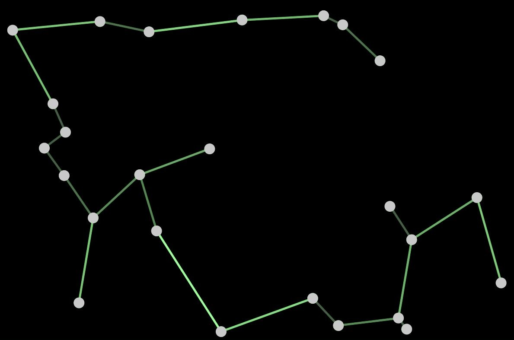

# MST Animation

This repo contains an old fun project that draws bouncing circles and 
a minimum spanning tree connecting the circles.
The animation spans all connected screens. 
Clicking anywhere spawns a new circle.

The animation is implemented with Processing 3.

